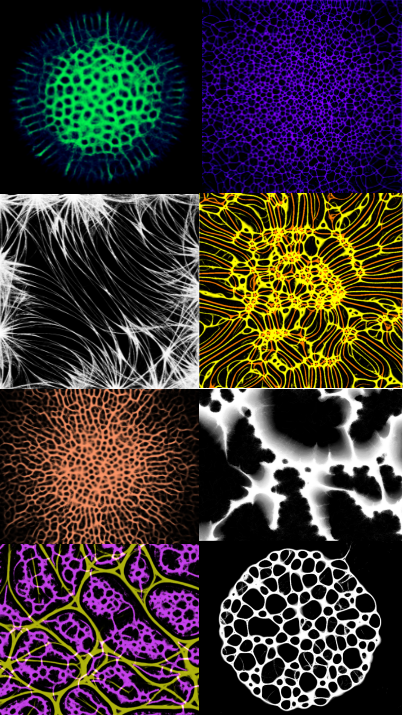

# Physarum

GPU-accelerated simulation of slime mold (Physarum) using OpenGL and GLSL shaders.
Settings can be changed, saved and loaded via a TUI (Terminal User Interface) implemented with ncurses.

